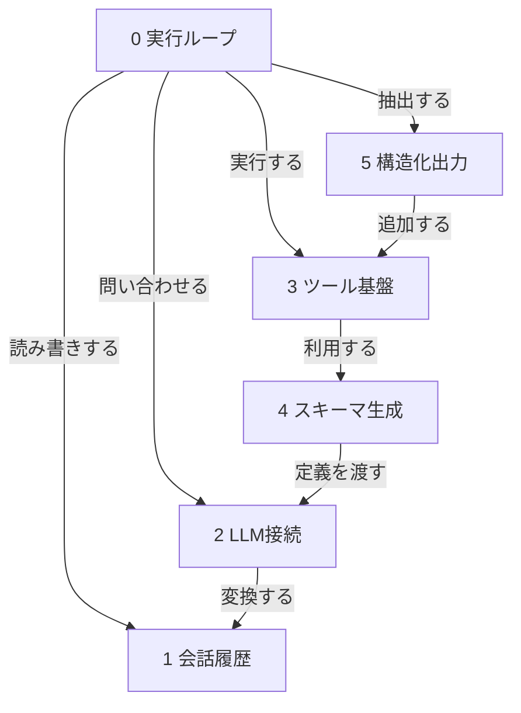

# my-ai-agent コード解析概要

このリポジトリは、LiteLLMを使ってLLMに問い合わせ、必要に応じてPython関数ツールを実行する小さなAIエージェント実装です。

中心になるのは `Agent` です。`Agent` は `ExecContext` に会話履歴を積み、`Client` へリクエストを送り、返ってきた `ToolCall` を実行して、最終的な回答を `AgentResult` として返します。

## コンポーネント関係

## 読む順番

1. [会話履歴](./page_01_会話履歴.md)
2. [LLM接続](./page_02_LLM接続.md)
3. [スキーマ生成](./page_03_スキーマ生成.md)
4. [ツール基盤](./page_04_ツール基盤.md)
5. [構造化出力](./page_05_構造化出力.md)
6. [実行ループ](./page_06_実行ループ.md)

## ファイルインデックス

| index | path | 役割 |
| --- | --- | --- |
| 0 | `src/agent/agent.py` | エージェントの実行ループと最終結果判定 |
| 1 | `src/agent/context.py` | 実行状態、履歴、戻り値の管理 |
| 2 | `src/agent/helpers.py` | ツールschema生成と補助関数 |
| 3 | `src/agent/llm.py` | LiteLLM呼び出しとメッセージ変換 |
| 4 | `src/agent/main.py` | 現時点ではダミーの実行入口 |
| 5 | `src/agent/tool_base.py` | ツール基底クラスと関数ツール |
| 6 | `src/agent/types.py` | Message、ToolCall、ToolResult、Event |

