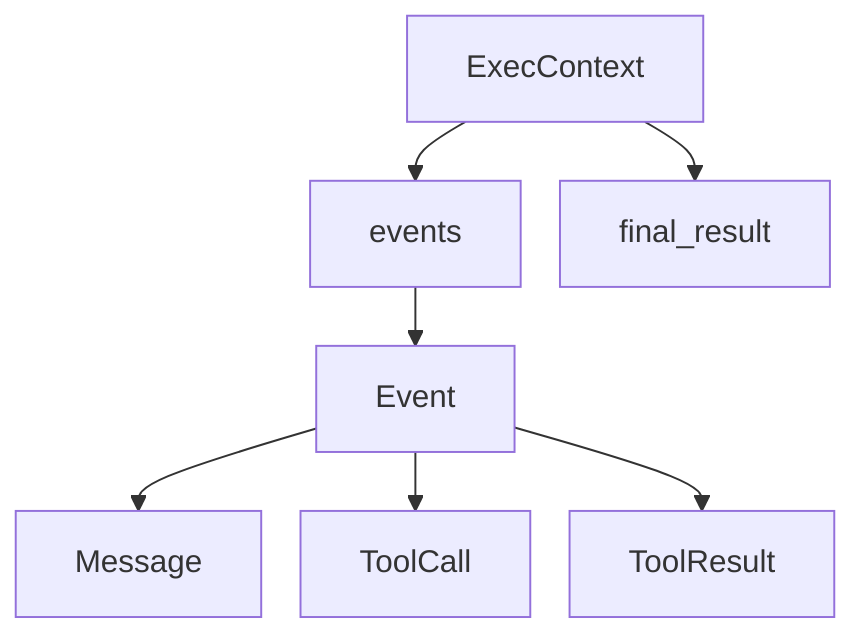

# 会話履歴

## 概要

会話履歴は、エージェントが一回の実行で何を見て、何を返し、どのツールを呼んだかを保存する仕組みです。

主な型は `types.py` の `Message`、`ToolCall`、`ToolResult`、`Event` と、`context.py` の `ExecContext` です。`ExecContext.events` に `Event` が追加され、各 `Event.content` にメッセージやツール結果が入ります。

## 図解

## 重要なポイント

- `exec_id` は一回の実行を識別するIDです。
- `step` は実行ループの回数を表します。
- `final_result` が `None` の間、かつ `step < max_steps` の間だけ継続します。
- `Event` は author と timestamp を持ち、誰が何を追加したかを追える形になっています。

## 関連ファイル

- `src/agent/context.py`
- `src/agent/types.py`

