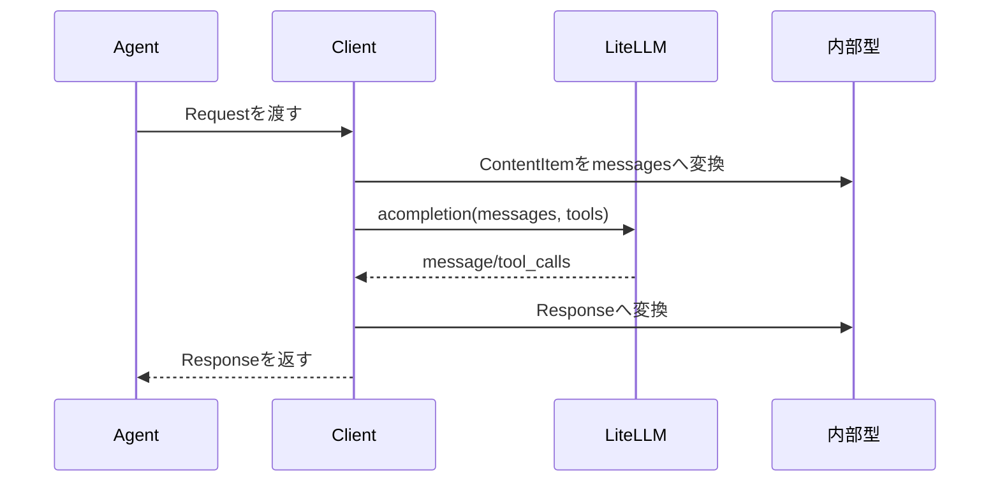

# LLM接続

## 概要

LLM接続は、内部の履歴データをLiteLLMに渡せる形式へ変換し、LiteLLMの返答を内部の `Message` や `ToolCall` に戻す層です。

`Client.generate()` は `Request` を受け取り、`build_msgs()` でチャットメッセージを作り、`acompletion()` を呼び出します。返答は `_parse_response()` で `Response` に変換されます。

## 図解

## 重要なポイント

- `Request.insts` は system message として扱われます。
- `Message` はそのまま role/content に変換されます。
- `ToolCall` は assistant の `tool_calls` として履歴へ戻されます。
- `ToolResult` は role `tool` のメッセージとして戻されます。
- `Client.ask()` は簡易問い合わせAPIで、エラー時は `RuntimeError` を投げます。

## 関連ファイル

- `src/agent/llm.py`
- `src/agent/types.py`

