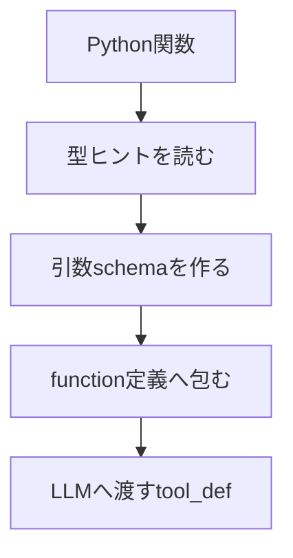

# スキーマ生成

## 概要

スキーマ生成は、Python関数の型ヒントからLLMが理解できるJSON Schemaを作る処理です。

`func_input_schema()` は `inspect.signature()` と `get_type_hints()` を使い、関数引数を `string`、`integer`、`number`、`boolean`、`array` などへ変換します。`format_tool_def()` はその schema をOpenAI互換の `type: function` 形式へ包みます。

## 図解

## 重要なポイント

- `self`、`ctx`、`context` はLLMへ見せる引数から除外されます。
- `list[str]` のような配列は `type: array` と `items` に分けて表現されます。
- Pydanticモデルは `model_json_schema()` を使ってschema化されます。
- schemaは `FuncTool._make_def()` から使われます。

## 関連ファイル

- `src/agent/helpers.py`
- `src/agent/tool_base.py`

