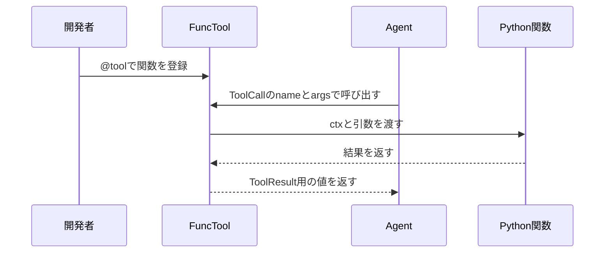

# ツール基盤

## 概要

ツール基盤は、普通のPython関数をエージェントが呼び出せるツールへ変換する仕組みです。

`BaseTool` は共通インターフェースを定義し、`FuncTool` は関数を包みます。`@tool` デコレータを使うと、関数から `FuncTool` を作成できます。エージェントはLLMから返った `ToolCall` を見て、対応するツールを実行します。

## 図解

## 重要なポイント

- 関数に `ctx` 引数があれば、`FuncTool` は実行コンテキストを渡します。
- 同期関数でも非同期関数でも、`FuncTool.exec()` が必要に応じて await します。
- `Agent.act()` は未知のツールを `error` として記録します。
- 成功したツール結果は `ToolResult(status="success")` として履歴へ追加されます。

## 関連ファイル

- `src/agent/tool_base.py`
- `src/agent/helpers.py`
- `src/agent/agent.py`

