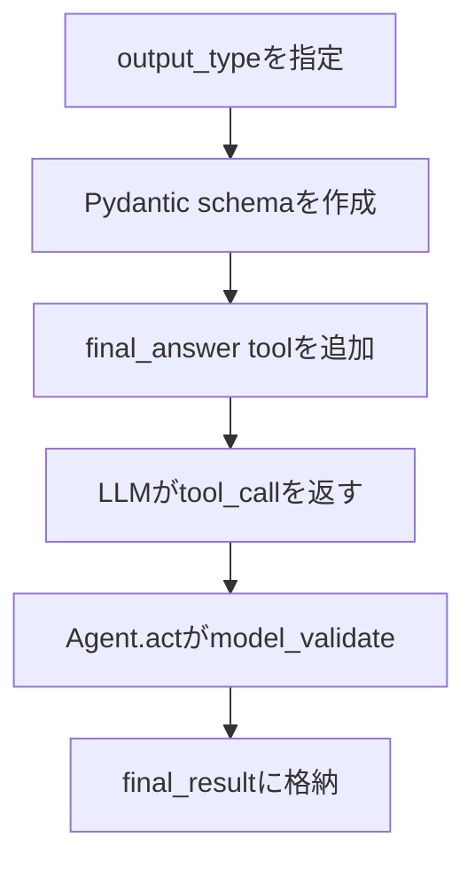

# 構造化出力

## 概要

構造化出力は、最終回答をPydanticモデルとして受け取るための仕組みです。

`Agent` に `output_type` を渡すと、`_setup_tools()` が `final_answer` という特別なツールを追加します。LLMはこのツールを使って最終回答を返し、`Agent` は `ToolResult` から型付きの値を取り出します。

## 図解

## 重要なポイント

- `output_type.model_json_schema()` から最終回答のschemaを作ります。
- `final_answer` は通常のツールと同じ `FuncTool` として扱われます。
- `output_tool_name` が設定されると、`tool_choice` は `required` になります。
- 成功した `final_answer` の `ToolResult` が最終結果になります。

## 関連ファイル

- `src/agent/agent.py`
- `src/agent/helpers.py`
- `src/agent/tool_base.py`

