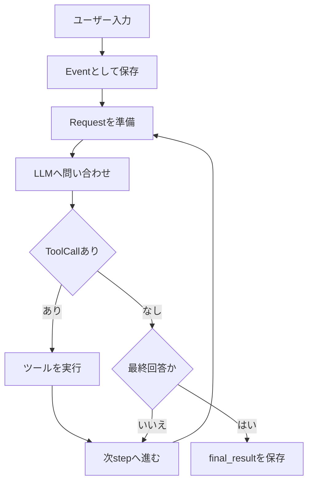

# 実行ループ

## 概要

実行ループは、AIエージェント全体の流れを制御する中心です。

`Agent.run()` はユーザー入力を `Event` として追加し、`ctx.is_continue()` が真の間 `step()` を繰り返します。各 `step()` ではLLMに問い合わせ、返答を履歴に追加し、必要ならツールを実行します。

## 図解

## 重要なポイント

- `max_steps` により無限ループを防ぎます。
- `response.err_msg` があれば `RuntimeError` として止めます。
- 通常回答では assistant `Message` が最終結果になります。
- 構造化出力では `final_answer` の `ToolResult` が最終結果になります。

## 関連ファイル

- `src/agent/agent.py`

